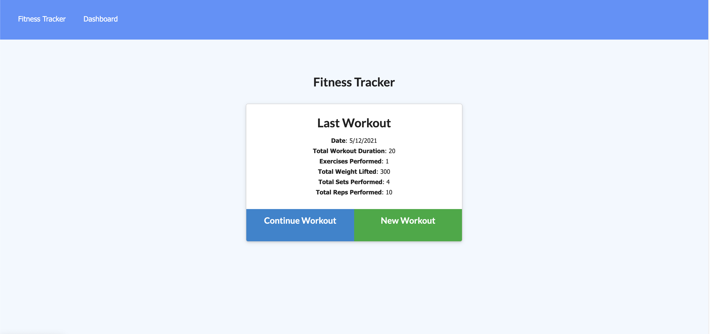
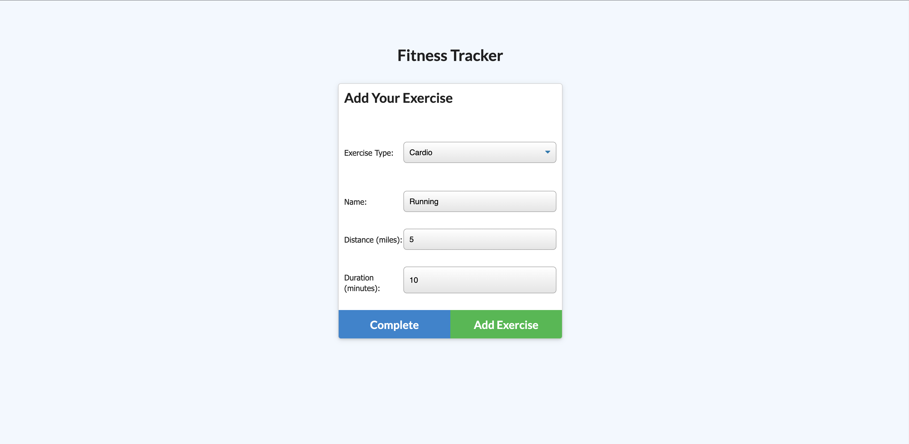
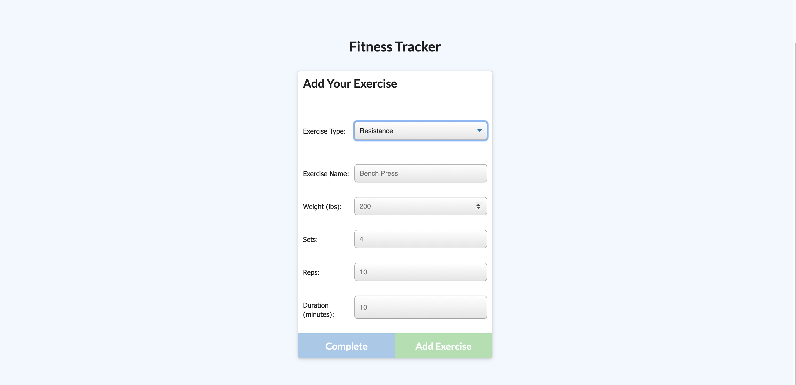
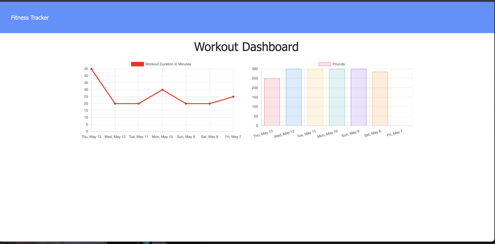

# Fitness-Tracker
  

  Menu
 </img>
 Cardio Workout Menu
 </img>
 Resistance Workout Menu
 </img>
 Workout Dashboard
 </img>
  # Table of Contents 
  * [Installation](#Installation) 
  * [Usage](#Usage) 
  * [License](#license)
  * [Contributing](#Contribute) 
  * [Testing](#Testing)
  * [Questions](#Questions)
  
  # Description 
This site allows you to view, create, and track daily workouts with a graph and total ammont of weight reps, or miles you ran in that workout.Here is the link to Deployed Site:[Link]('https://fitness-tracker-arecio.herokuapp.com/?id=609d904d2c4c8d0015908732')

  # Installation
   **npm i**

  # Testing
  **npm test**

  # Contribute
  **Create pull request**

  # Usage
  **git clone**

  # Questions
  If you had any questions feel free to contact my email cuba289@gmail.com

  To see more of my work visit me here [Arecio3](https://github.com/Arecio3)

  # License
  

